# Coding Notebook for Phase 2 project
## Soo Ho (John) Park, Nicholas Wertz, Nicholas Kennedy

# Introduction

King County is one of the most coveted real estate areas in Washington state, especially as the metropolitan hub of Seattle attracts more and more people. Our stakeholder is a house-flipping company that aims to buy real estate in its original condition at the lowest price possible and quickly sell it to a new buyer at a profit after renovation. However, due to the sheer number of homes and a fluctuating market, our stakeholder is having a difficult time estimating current house prices. What homes can be “flipped” and yield the highest profits?

The KaPow Consulting Team, comprised of data scientists, can offer a set of recommendations tailored to a house-flipper’s needs by utilizing a multiple regression model as a predictive measure. We analyze which indicators can predict the market sale price of a home and find which undervalued homes have the potential to be sold at a higher price. First, our data analysis found that price is heavily influenced by the size of living space, closeness to water, and whether the home is in the Northwest or West regions of King County. From our predictive multiple regression model, we then ascertained a series of undervalued homes that had a higher predicted value than the actual value it was sold. Analyzing a case study that meets the criteria of an undervalued home, we show how much potential profit could be made. By following these recommendations, our stakeholders can make more informed decisions when investing in undervalued homes with a high potential for profit. 

# Data Understanding
Our original data set, `kc_house_data.csv` contained 21597 home sales with 21 columns from 2014-2015 in King County, Washington, the county comprised of Seattle and the surrounding areas. In addition to sale price and home id, 19 other standard descriptors of including square footage, location, grade, waterfront view etc were given for these some 20K data points. Of these sales, 353 were duplicates, meaning homes in this subset were sold more than once in the 2-year span. These sales are for 177 unique homes, a very small sample given our original data set. Nevertheless, these represent the only real data of house flipping in our set, and this is important for our House-Flipping stake-holders.  

# Data Preparation
### Data Cleaning: 
Starting data preparation, we first extracted and removed the duplicate ids, the set of our flipped homes into a separate dataset, resales_df.csv for more of a case-study-type analysis. <a href =https://github.com/soohojp/Phase2_Project/blob/main/old_notebooks/clean_and_FE.ipynb>https://github.com/soohojp/Phase2_Project/blob/main/old_notebooks/clean_and_FE.ipynb</a>, section 1.

With these removed and set aside, we then removed outliers that were 3 standard deviations away from the mean on the numerical variables with high variance except for our target variable, sale price. These measures reduced the size of our dataset to 21059 data points. Documentation on how this was done can be found in our git repo at <a href =https://github.com/soohojp/Phase2_Project/blob/main/old_notebooks/clean_and_FE.ipynb>https://github.com/soohojp/Phase2_Project/blob/main/old_notebooks/clean_and_FE.ipynb </a> section 4.

### Feature Engineering: 
After our EDA, we chose to engineer features based on geographic location: zip code, latitude and longitude. Zip code was binned and dummy- encoded to give us 3 new variables, `label_urban`, `label_suburban` and `label_rural`. Documentation in <a href =https://github.com/soohojp/Phase2_Project/blob/main/old_notebooks/clean_and_FE.ipynb>https://github.com/soohojp/Phase2_Project/blob/main/old_notebooks/clean_and_FE.ipynb </a>  section 2.

We also used latitude and longitude to engineer 2 additional features, region and waterfront distance. Geographical coordinates were binned and dummy encoded in 9 region variables. N, NE, E, SE, S, S, W, NW and central King County. <a href =https://github.com/soohojp/Phase2_Project/blob/main/old_notebooks/clean_and_FE.ipynb>https://github.com/soohojp/Phase2_Project/blob/main/old_notebooks/clean_and_FE.ipynb </a> section 3

We finally created variable for distance to waterfront which returned the distance to the nearest property with a waterfront view. To do this we first created a cooridinates column that contained both longitude and latitude as a tuple. Next we defined a function called closest_water(coordinate), that looked at the list of waterfront property coordinates, and returned the distance to the closest one given a set of coordinates. Mapping this function to our dataframe coordinates, we obtained the distance in km to the nearest waterfront property for all of our homes, and called this variable closest_water. Documentation found here: <a href =https://github.com/soohojp/Phase2_Project/blob/main/old_notebooks/clean_and_FE.ipynb>https://github.com/soohojp/Phase2_Project/blob/old_notebooks/main/clean_and_FE.ipynb </a>  section 5.

We merged all of this into a master data file which will proceed to use in our analysis

# The Process of Making a Multiple Linear Regression Model
In order to create the most effective multiple linear regression model, we took the following steps and modifications:
- Splitting our train and test data 8:2 ratio
- Creating a dummy regression basline model using mean price
- Scaling our train data and then fitting it to the linear regression model
- Eliminating predictors predictors with low Pearson correlation or P-value in relation to the target
- Making new variables such as log-transformed distance to waterfront, bins by community type, bins by region
- Trying the model on our test data
- Checking the heatmap and VIF for multicollinearity
- Verifying for a normal distribution of residuals and heteroskedasticity

In total, we completed five models, each of which honed in more deeply on the relevant predictors of home sales price. We will highlight some of the important findings that led us to our final model.

### Choosing to Log-Transform Distance to Water:
In looking at the distribution of `closest_water`, we see that it is not normally distributed: To make this feature better fit our assumptions for linear regression, we decided to take the log of distance to waterfront, which returned a more normal distribution. We also believe that using the log makes conceptual sense for this feature, as distance to water is much more impactful at closer distances, when you can walk, run and bike to it. It has increasingly, and non-linearly diminishing impact on home prices as the distance to water lengthens. We compare both regular and the log-transformed distance to waterfront below to show how it better meets our assumptions for linear regression.

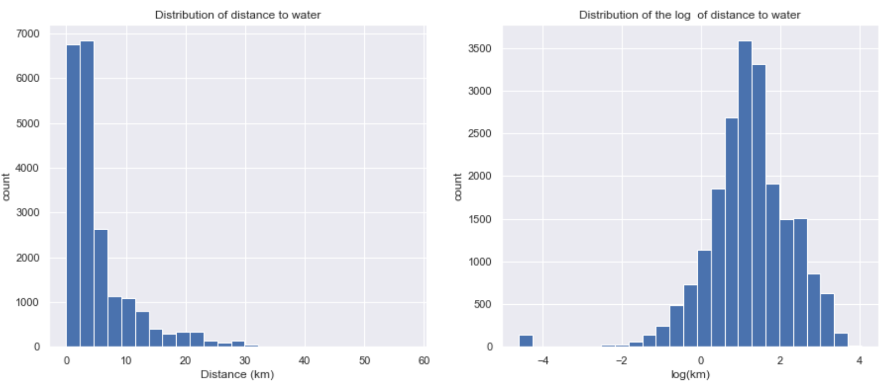

### Comparing our assumptions for linear regression visually:
Notice above how the log transformed distance to water (Right) is much more successful at meeting our assumption of being normally distributed. With these to assumptions validated for the log transformed distance to water, we proceed to check the assumption of linearity below:

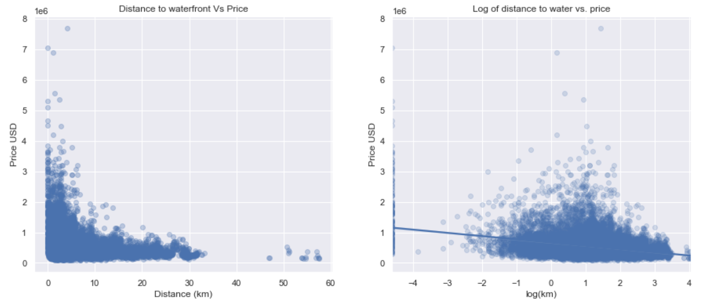

Notice above how the log transformed distance to water (Right) is much more successful at meeting our assumption of linearity with our target variable, `price`. With these to assumptions validated for the log transformed distance to water, we choose this as our new variable instead of distance to water

# Final Model
The variables used in our final model
metrics_list5 = ['price', 'sqft_living', 'log_water', 'group_NW','group_SW','group_W']

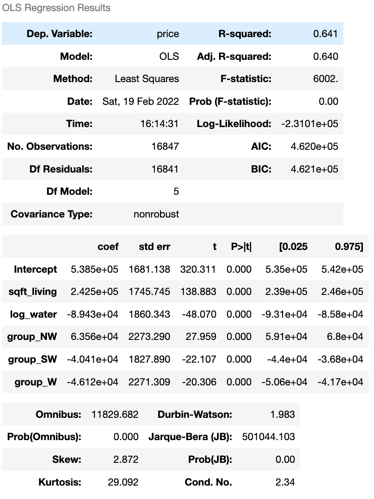

## Checking the VIF
Again we see if our assumption of no multicolinearity is violated. 

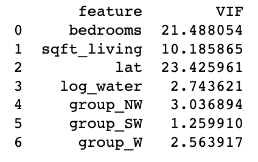

### Deciding on this as our final model
The VIFs above are all under 5, meaning this model passes the test of multicolinearty. It's R-squared has not been reduced by much and we are now only using 5 variables. 4 of which are based simply off of geographic coordinates. It's simplicity gives it practical power, as these are all very easy to track. 

**64-65%** of the variation in `price` is explained by our model. We meet our assumptions for linear regression and proceed to further analyze it. Below we do a little data house-keeping

### Unscaling our final model to gain additional insights with more conceptually-friendly coefficients
Next, we check our model on unscaled train-data to see how the coefficients look. 

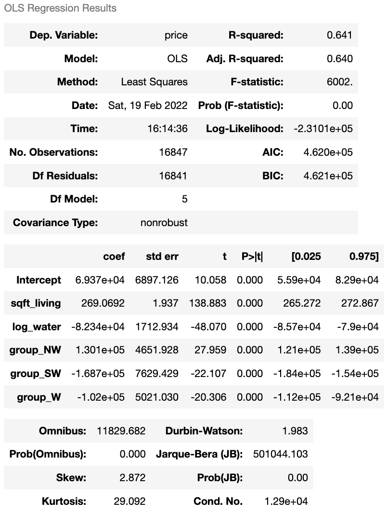

## Interpretation of our final model unscaled
- As you increase living area sq ft by 1, our model predicts an increase in price of almost \$270 USD
- As you descrease distance to water by 1%, our model predicts and increase in price of \$823 USD
- NW: being located in the NW region predicts a higher price by 13K USD
- SW: being located in the SW region predicts a lower price by 17K USD
- W: being located in the W region predicts a lower price by 10K USD

# Comparing R2 of model with test data

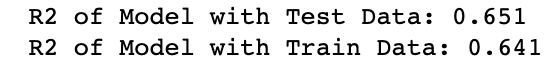

### Interpretatin Test Vs. Train
The R-squared of the model with the test data is very close to that of the train data. A close R-suqared value for both the train and test sets signify that the model is generalizing well. Thus, our final model exhibits qualities of a good model.

##  Calculating RSME
Here, we look at the root-mean-squared error, which gives us a value for on averege how much our predictions vary from the actual data in our sample

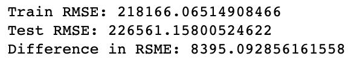

### Interpreting RSME: 
To get a summarized measure over all the instances in the test and training set, we calculated the Root Mean Squared Error. A big difference in value between the test and training set RSME is an indication of overfitting. But, considering that prices of homes are in the thousands if not a million-dollar range, we deemed that the difference in RSME of 8606.85 is not that high.

The total RSME is fairly high for this model, but this as we see below is because of high-priceed outliers. For most house-prices, our model is fairly accurate

## Normal Distribution of Residuals

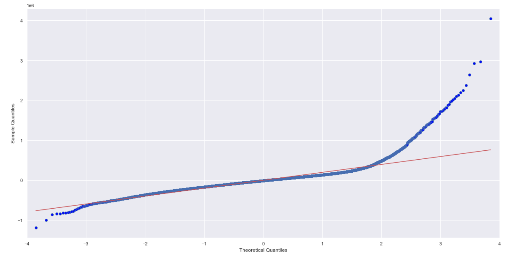

Q-Q plots let you check that the data meet the assumption of normality. They compare the distribution of your data to a normal distribution by plotting the quartiles of your data against the quartiles of a normal distribution. If your data are normally distributed then they should form an approximately straight line. Notice the points fall along a line in the middle of the graph, but curve off in the extremities with heavy tails. This may suggest that the data may have outliers that fall beyond the model.

## Heteroskedasticity and Lack of Trend in Errors

Heteroscedasticity produces a distinctive fan or cone shape in residual plots, meaning that as the fitted values increases, the variance of the residual also increases. Heteroscedasticity is a problem because OLS regression assumes that all residuals are drawn from a population that has a constant variance. As we can see from the graph above, there is a slight cone shape, meaning that there may be some heteroscedasticity.

# Multicolinearity

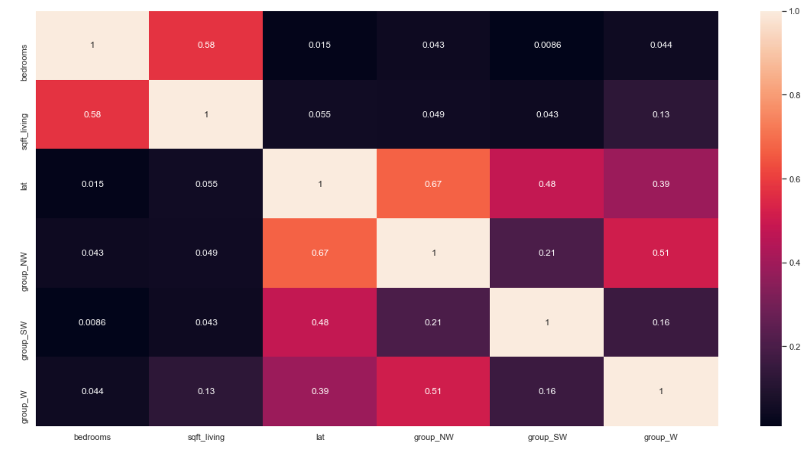

The interpretation of a regression coefficient is that it represents the average change in the dependent variable for each 1 unit change in a predictor, assuming that all the other predictor variables are kept constant. But, when multicolinearity is observed, it complicates this interpretation. With multicolinearity, 1 unit change in a predictor can not only change the dependent variable, but also another independent variable. Since multicollinearity is less than 0.7 between each of the variables, we can deem that the model is not multicollinear.

 # Undervalued Homes

A house flipper's main concern is to find which homes are being sold at a lower price in the market than its supposed value. Thus, my using the price predictor from our model, we aimed to pinpoint undervalued homes. We first combined the Train and Test datasets, adding on the longitude and latitude information onto it as well. Then, we created a new column to measure the difference in actual price and predicted price. From price_table_final, we filtered out homes that had a positive price difference, which means that its predicted price is higher than the actual price that it was sold.

The potential average profit yield from this batch of undervalued homes is approximately $134010.36.

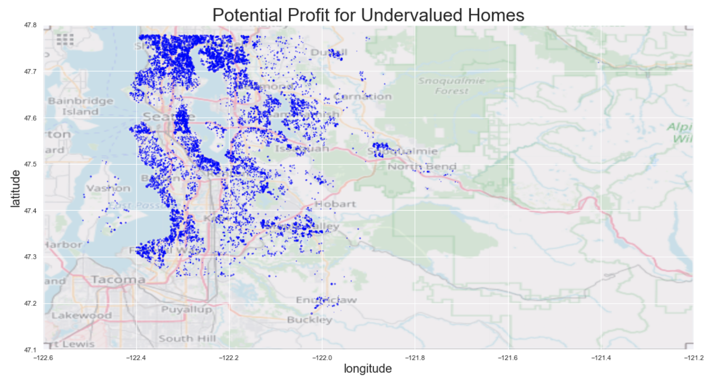

## Case Study

As a case study, we selected one of the homes near the average potential profit yield metric. By utilizing the coordinates (latitude, longitude) and the zipcode, we were able to search its exact location via Google Maps.

Address: 2751 NE 103rd St.

#### Image of 2751 NE 103rd St. Courtesy of Goolge Street View

    

#### Location Via Google Maps

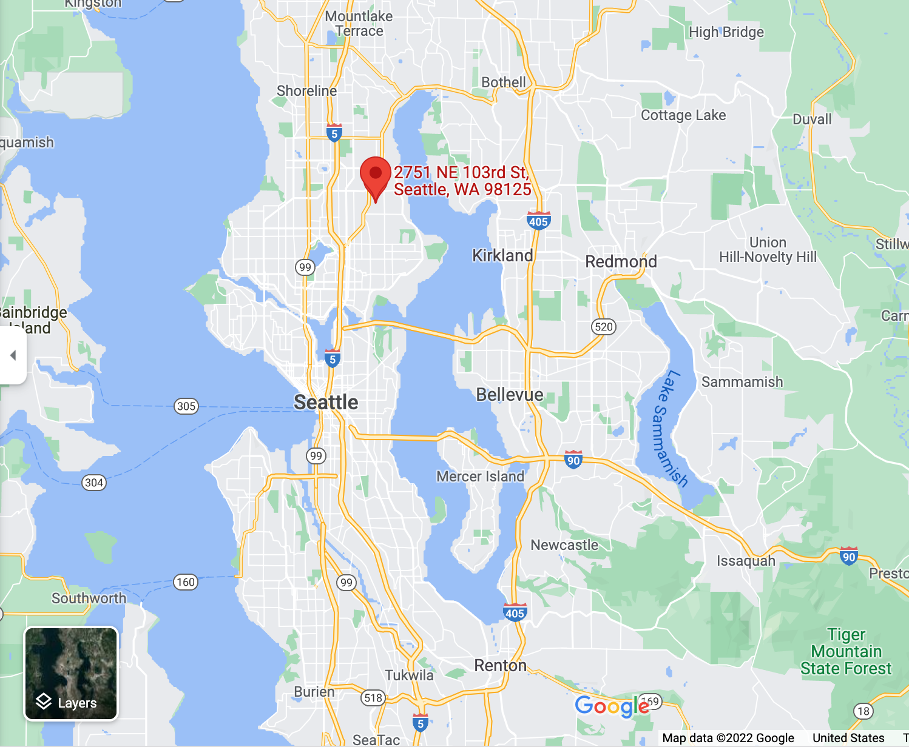

This example fits our predictions very closely. It is located in the Northwest region of King County, which also is relatively close to water. The size of the living space could be possibly improved to further raise the price. For such homes, Kapaw Consulting can further assist in investigating whether changing the mutable features such as home size, grade, condition, or interior design could potentially raise the home price.

# Further Considerations: Grade as an Additional Factor

In our final model, we unfortunately could not utilize grade due to its high multicollinearity with sqft_living. 
We still believe that grade is a major factor in the price of a home, and while the livable area of a home may contribute to its grade, it is more to do with the quality of the materials and craftsmanship. It is also reasonable to assume someone may want to spend more on higher grade home than on more square feet.

We decided to run a statmodel ols linear regression test. Like all our other linear regressions, we split it into a 80% train and 20% test data. We luckily since we only have one variable we are examining, there is no need for us to standard scale. So we move on to fitting our training data to our model using statmodels's ols feature

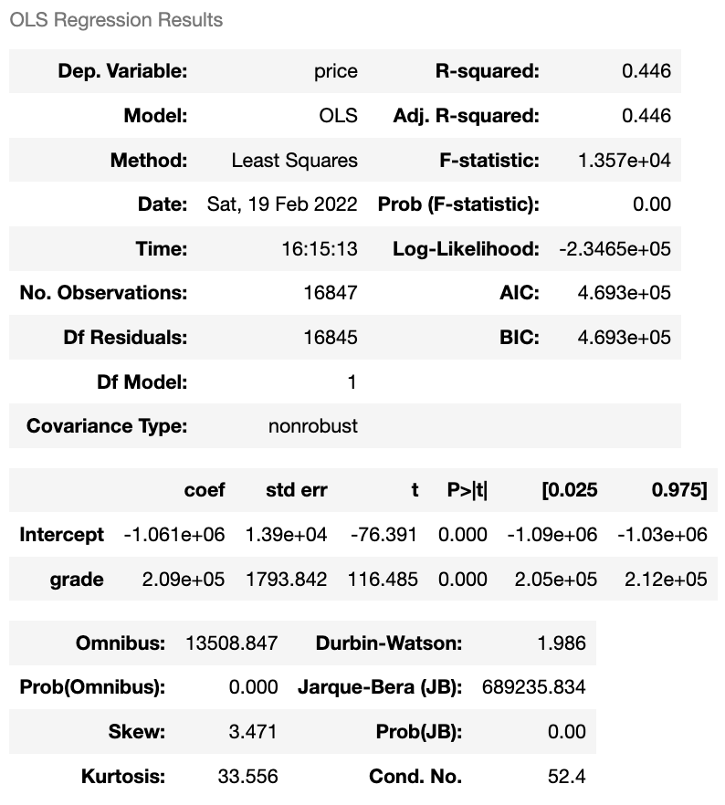    

#### The above states that our simple model that includes the grade as our only inferential perameter predicts 44.6% of the variation in home prices in our training data. Our coefficent tells us that for every change in one numeric grade, we see, on average, a jump in home price of \$210,000.

Next we wanted to see our median price, median sqft_living, and median price per sqft_living for each group. We then graphed both of these results below.

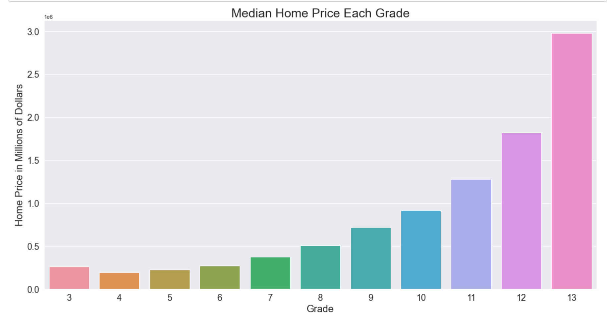    

#### Now that we see this visually, we consider if this makes sense. 
At first, the grade 3's appear to have a median price higher than the grade 4's and 5's! However, if we do a quick value count of grades,

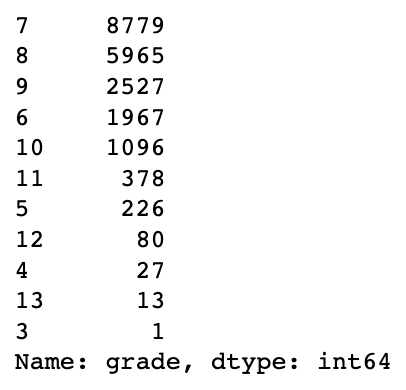    

### We see that there is only a single grade 3 home in our data! 
We will consider the single grade 3 home an unusually highly priced home (most likely an outlier if we had more grade 3 homes to compare it to) and move on. 

Moving on to grade 4, we can visually see that the lowest grade homes have the lowest median home price and the highest grade, grade 13, have the highest price. This makes sense. Next we will further examine the price per sqft for each grade.

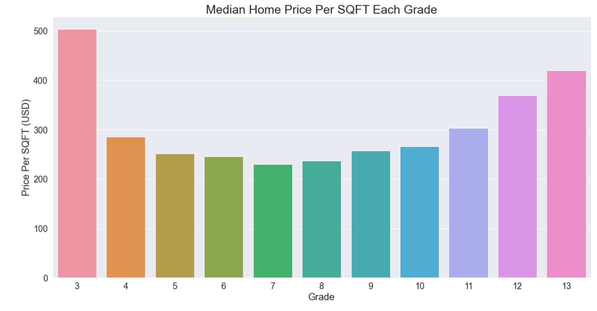    

#### At first glance this again may not make sense! 
How can the lowest grade in our model have the absolute highest median price square foot?!
We recall that we considered our single grade 3 home a probable outlier, skewing our data. 

But even if that is true, our price seems to decrease from grades 4 to to 7 before going back up as we would expect! Perhaps something is "diluting" the price per square foot? We looked at our 'med_price_by_grade' dataframe to see what was going on. 

It can be seen that because our sqft_living value is continually increasing, this causes our "dilution" of price per sqft value. Jumping from grade 4 to 5, our sqft_living increases by 28.5%, while their respective prices are only a 13.1% change. Any time our price change percentage is beaten by our sqft_living percentage, we have "diluted" our value per sqft of our homes. 

Looking at the change from grade 10 to 11 we have a 22% increase in living space and a 39.7% change in price, registering as a positive change on our graph.

We then created a new category that is the percent change between each grade. As we had no grade 1 or 2 houses, we could not get the difference in price between them or for our grade 3 homes. We also must throw out the grade 4 result as our probable outlier grade 3 has skewed it . These results were then graphed as both a bar and line graph. 

We can see that our grade 3 has no result for percent change and our grade 4 has been massively skewed and should be ignored unless we obtain more data in the future. We then graphed our remaining results to visually interpret them.

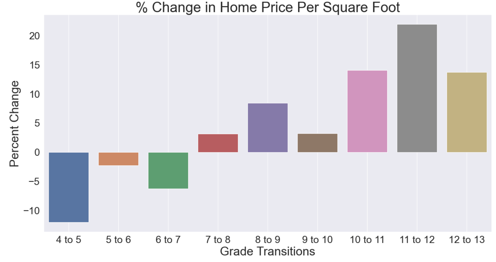

As you can see, it would be best practice to begin with a grade 7 or lower house, then during a flip, rennovate the home until it is a grade 8 or higher as there are massive possible profit gains.

# Conclusion

Our data analysis suggests that price has a statistically significant correlation with the size of living space, closeness to water, and the region in which it is located in. By employing a multiple regression model with the aforementioned features, we were able to extract all of the undervalued homes from the original dataset. Homes that had a higher predicted price in the model than the actual price fit the criteria of undervalued homes. The KaPow Consulting Team recommends that our stakeholders invest in such undervalued homes, as they may have a higher potential for profit yield. The case study conducted at the end goes further to demonstrate how much profit could be up for grabs.
